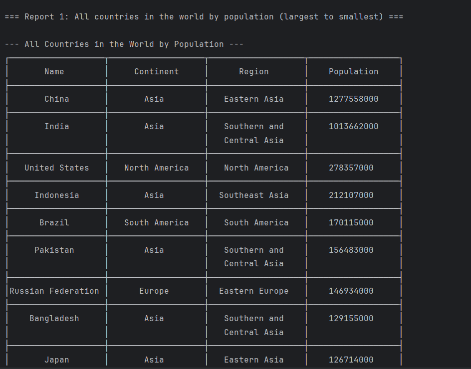

All Reports for World_Population
## Requirements Evidence Table

| ID | Requirement Name | Met? | Screenshot |
|----|------------------|------|------------|
| 1  | All countries in the world organised by population (desc) | Yes |  |
| 2  | All countries in a continent organised by population (desc) | Yes/No |  |
| 3  | All countries in a region organised by population (desc) | Yes/No |  |
| 4  | Top N populated countries in the world | Yes/No |  |
| 5  | Top N populated countries in a continent | Yes/No |  |
| 6  | Top N populated countries in a region | Yes/No |  |
| 7  | All cities in the world organised by population (desc) | Yes/No |  |
| 8  | All cities in a continent organised by population | Yes/No |  |
| 9  | All cities in a region organised by population | Yes/No |  |
| 10 | All cities in a country organised by population | Yes/No |  |
| 11 | All cities in a district organised by population | Yes/No |  |
| 12 | Top N populated cities in the world | Yes/No |  |
| 13 | Top N populated cities in a continent | Yes/No |  |
| 14 | Top N populated cities in a region | Yes/No |  |
| 15 | Top N populated cities in a country | Yes/No |  |
| 16 | Top N populated cities in a district | Yes/No |  |
| 17 | Population of the world | Yes/No |  |
| 18 | Population of a continent | Yes/No |  |
| 19 | Population of a region | Yes/No |  |
| 20 | Population of a country | Yes/No |  |
| 21 | Population of a district | Yes/No |  |
| 22 | Population of a city | Yes/No |  |
| 23 | Showing population living in cities vs not living in cities (world) | Yes/No |  |
| 24 | Showing population living in cities vs not living in cities (continent) | Yes/No |  |
| 25 | Showing population living in cities vs not living in cities (region) | Yes/No |  |
| 26 | Language report: Chinese | Yes/No |  |
| 27 | Language report: English | Yes/No |  |
| 28 | Language report: Hindi | Yes/No |  |
| 29 | Language report: Spanish | Yes/No |  |
| 30 | Language report: Arabic | Yes/No |  |
| 31 | Top N populated capital cities in the world | Yes/No |  |
| 32 | All capital cities in the world organised by population (desc) | Yes/No |  |

