# DevOPs_BSc_World_Population

All Reports for World_Population
## Requirements Evidence Table

| ID | Requirement Name                                                                                      | Met? | Screenshot                                                                                                                                                                    |
|----|-------------------------------------------------------------------------------------------------------|-----|-------------------------------------------------------------------------------------------------------------------------------------------------------------------------------|
| 1  | All countries in the world organised by population (largest to smallest)                              | Yes |                                                                                            |
| 2  | All countries in a continent organised by population (largest to smallest)                            | Yes | 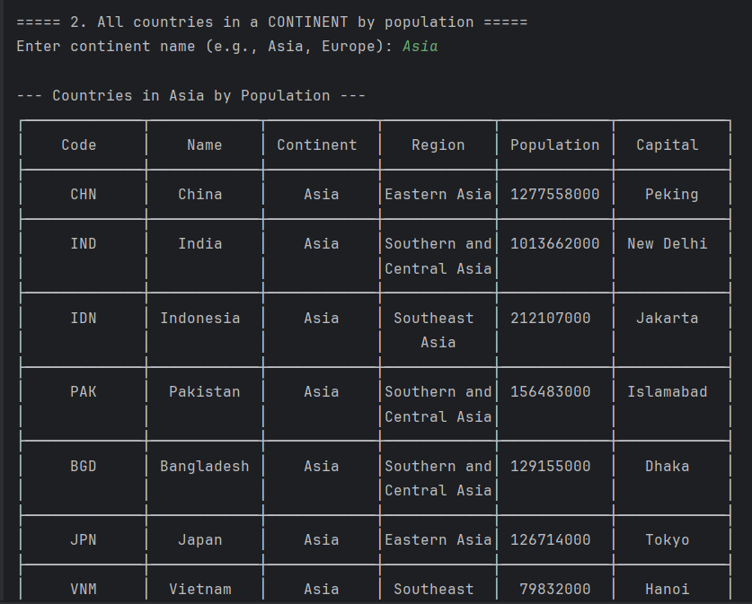                                                                                          |
| 3  | All countries in a region organised by population (largest to smallest)                               | Yes | 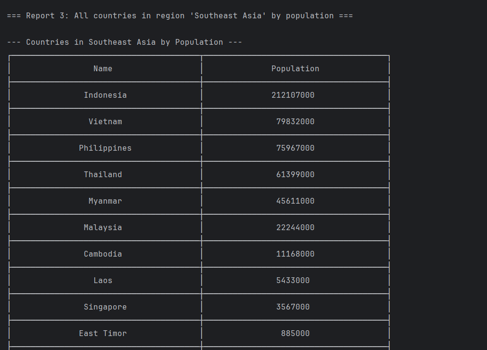                                                                                             |
| 4  | Top N populated countries in the world                                                                | Yes | 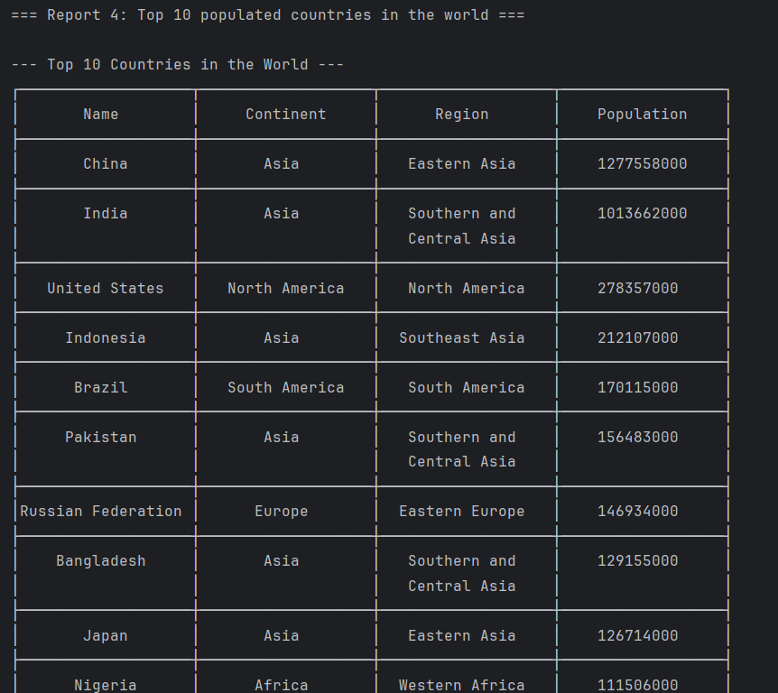                                                                                 |
| 5  | Top N populated countries in a continent                                                              | Yes | 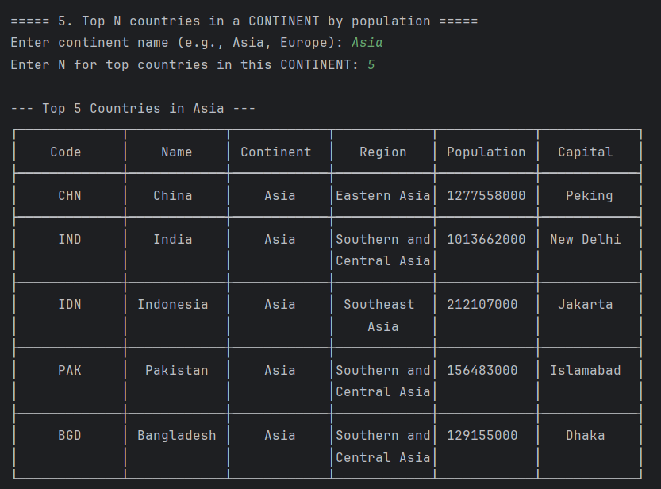                                                                                |
| 6  | Top N populated countries in a region                                                                 | Yes | 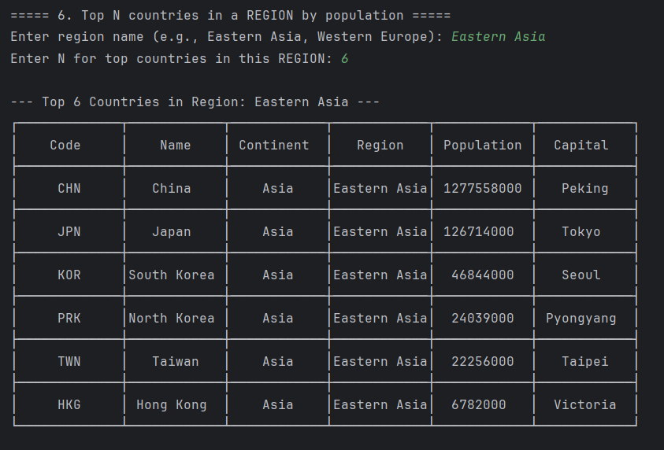                                                                                   |
| 7  | All the cities in the world organised by largest population to smallest.                              | Yes |                                                                   |
| 8  | All the cities in a continent organised by largest population to smallest.                            | Yes |                                                                 |
| 9  | All the cities in a region organised by largest population to smallest.                               | Yes |                                                                    |
| 10 | All the cities in a country organised by largest population to smallest.                              | Yes |                                                                   |
| 11 | All the cities in a district organised by largest population to smallest.                             | Yes |                                                                  |
| 12 | Top N populated cities in the world                                                                   | Yes |                                                                     |
| 13 | Top N populated cities in a continent                                                                 | Yes |                                                                   |
| 14 | Top N populated cities in a region                                                                    | Yes |                                                                      |
| 15 | Top N populated cities in a country                                                                   | Yes |                                                                     |
| 16 | Top N populated cities in a district                                                                  | Yes |                                                                    |
| 17 | All the capital cities in the world organised by largest population to smallest.                      | Yes |                                                                                               |
| 18 | All the capital cities in a continent organised by largest population to smallest.                    | Yes |                                                                                           |
| 19 | All the capital cities in a region organised by largest to smallest.                                  | Yes |                                                                                              |
| 20 | The top N populated capital cities in the world where N is provided by the user.                      | Yes |                                                                                     |
| 21 | The top N populated capital cities in a continent where N is provided by the user.                    | Yes |                                                                                 |
| 22 | The top N populated capital cities in a region where N is provided by the user.                       | Yes |                                                                                    |
| 23 | The population of people, people living in cities, and people not living in cities in each continent. | Yes |  |
| 24 | The population of people, people living in cities, and people not living in cities in each region.    | Yes |    |
| 25 | The population of people, people living in cities, and people not living in cities in each country.   | Yes |     |
| 26 | Population of The World                                                                               | Yes | 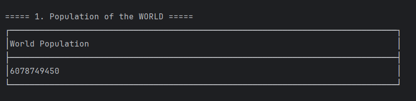                                                                                                                                                      |
| 27 | Population of A Continent                                                                             | Yes | 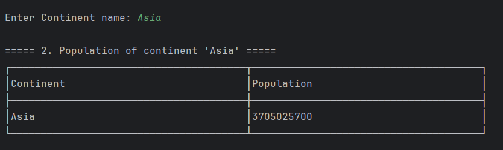                                                                                                                                                      |
| 28 | Population of A Region                                                                                | Yes | 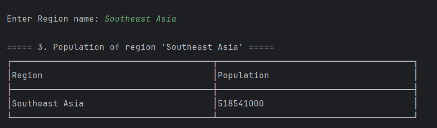                                                                                                                                                      |
| 29 | Population of A Country                                                                               | Yes | 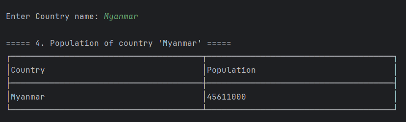                                                                                                                                                      |
| 30 | Population of A District                                                                              | Yes | 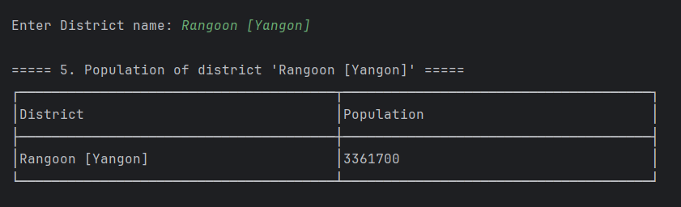                                                                                                                                                      |
| 31 | Population of A City                                                                                  | Yes | 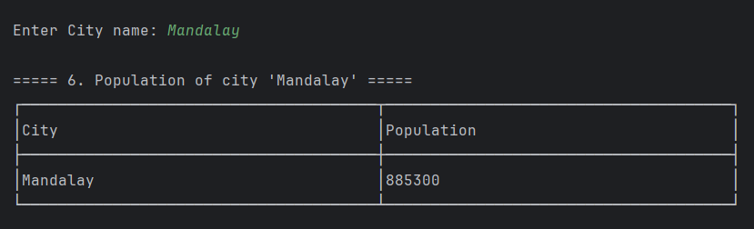                                                                                                |
| 32 | Population By Spoken Language                                                                         | Yes | 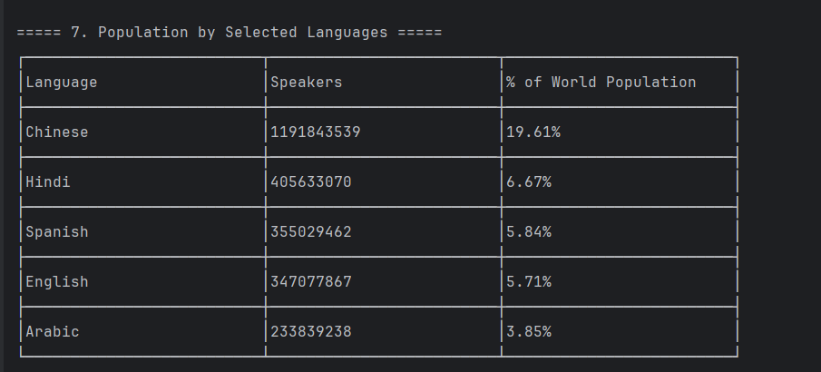                                                                                                      |

