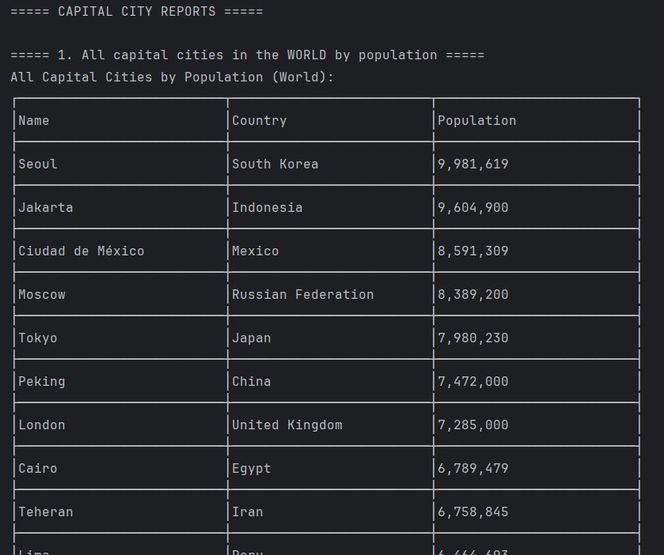
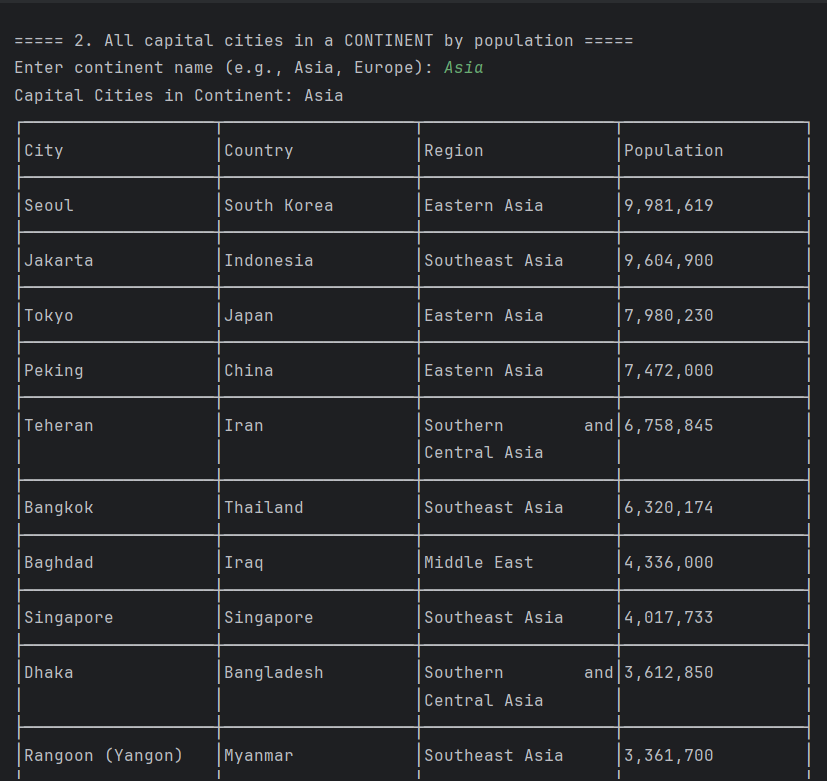
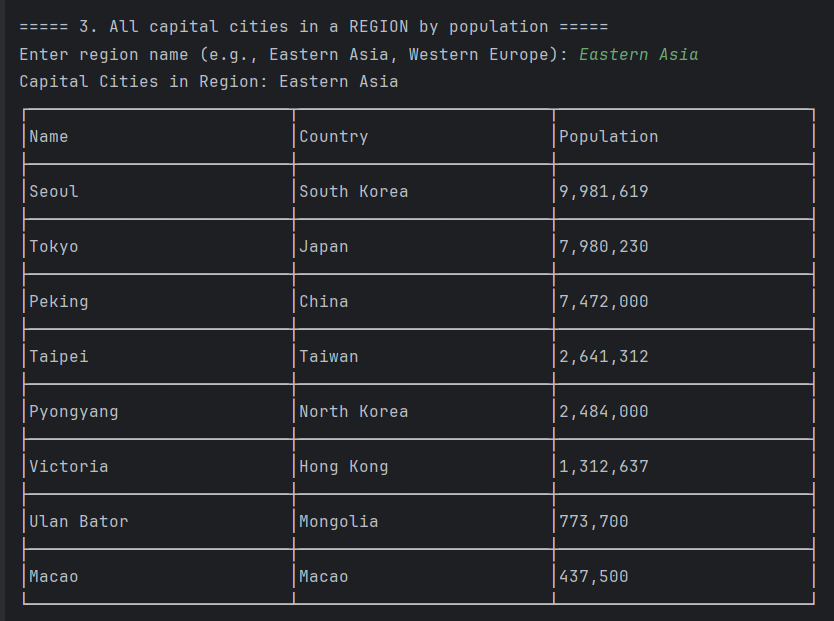
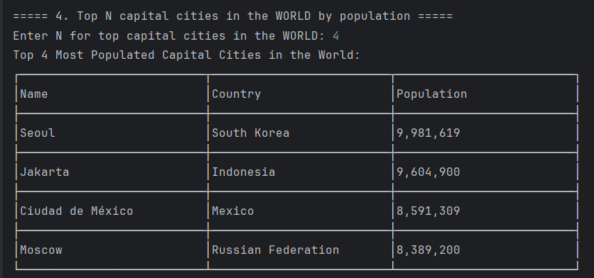
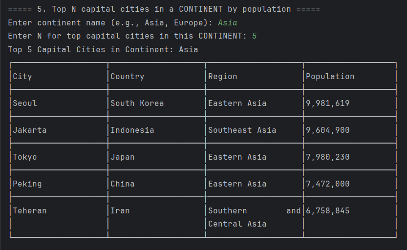
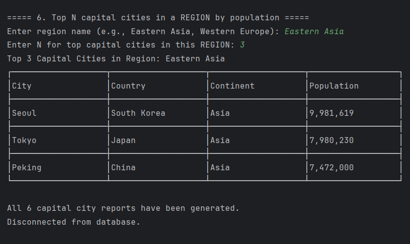

All Reports for World_Population
## Requirements Evidence Table

| ID | Requirement Name                                                                   | Met? | Screenshot                                                                         |
|----|------------------------------------------------------------------------------------|----|------------------------------------------------------------------------------------|
| 1  | All countries in the world organised by population (largest to smallest)           | Yes |  |
| 2  | All countries in a continent organised by population (largest to smallest)         | Yes |                                                                               |
| 3  | All countries in a region organised by population (largest to smallest)            | Yes |                                                             |
| 4  | Top N populated countries in the world                                             | Yes |                                                             |
| 5  | Top N populated countries in a continent                                           | Yes |                                                             |
| 6  | Top N populated countries in a region                                              | Yes |                                                             |
| 7  | All the cities in the world organised by largest population to smallest.           | Yes/No |                                                             |
| 8  | All the cities in a continent organised by largest population to smallest.         | Yes/No |                                                             |
| 9  | All the cities in a region organised by largest population to smallest.            | Yes/No |                                                             |
| 10 | All the cities in a country organised by largest population to smallest.           | Yes/No |                                                            |
| 11 | All the cities in a district organised by largest population to smallest.          | Yes/No |                                                            |
| 12 | Top N populated cities in the world                                                | Yes/No |                                                            |
| 13 | Top N populated cities in a continent                                              | Yes/No |                                                            |
| 14 | Top N populated cities in a region                                                 | Yes/No |                                                            |
| 15 | Top N populated cities in a country                                                | Yes/No |                                                            |
| 16 | Top N populated cities in a district                                               | Yes/No |                                                            |
| 17 | All the capital cities in the world organised by largest population to smallest.   | Yes |                                                            |
| 18 | All the capital cities in a continent organised by largest population to smallest. | Yes |                                                            |
| 19 | All the capital cities in a region organised by largest to smallest.                                                             | Yes |                                                            |
| 20 | The top N populated capital cities in the world where N is provided by the user.                                                            | Yes |                                                            |
| 21 | The top N populated capital cities in a continent where N is provided by the user.                                                          | Yes |                                                            |
| 22 | The top N populated capital cities in a region where N is provided by the user.                                                              | Yes/No |                                                            |
| 23 | The population of people, people living in cities, and people not living in cities in each continent.                | Yes/No |                                                            |
| 24 | The population of people, people living in cities, and people not living in cities in each region.            | Yes/No |                                                            |
| 25 | The population of people, people living in cities, and people not living in cities in each country.              | Yes/No |                                                            |
| 26 | Language report: Chinese                                                           | Yes/No |                                                            |
| 27 | Language report: English                                                           | Yes/No |                                                            |
| 28 | Language report: Hindi                                                             | Yes/No |                                                            |
| 29 | Language report: Spanish                                                           | Yes/No |                                                            |
| 30 | Language report: Arabic                                                            | Yes/No |                                                            |
| 31 | Top N populated capital cities in the world                                        | Yes |                                                            |
| 32 | All capital cities in the world organised by population (desc)                     | Yes |                                                            |

